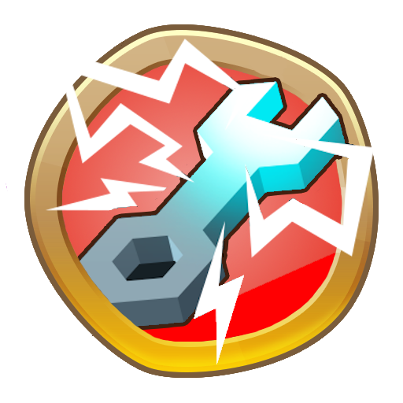
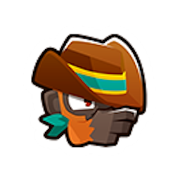
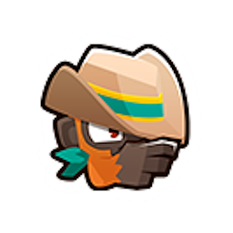
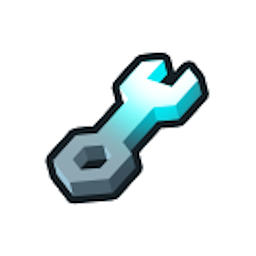
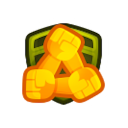
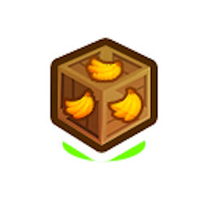
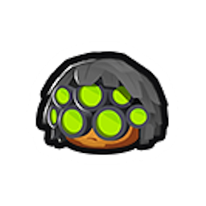
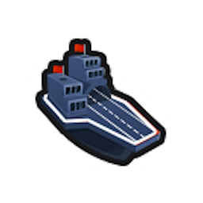

<h1 align="center">

Buffs In Shop
</h1>

<h3 align="center">Adds many tower buffs to the in game shop that can be directly purchased for towers</h3>

Adds 20+ of the game's buffs as entries into the shop that can be purchased to permanently apply them to a tower.

Most buffs get a 50% discount for subsequent purchases.

By default, buffs will only show up in the shop if the tower/upgrade they originate from is allowed to be used in the
current match. This can be configured in the Mod Settings, along with the costs of the buffs.
(To make a buff stop appearing in the shop at all, set the cost to -1)

There is also a setting that allows placing buffs on any tower regardless of the Tower Set or Tower Type restrictions.

### Buffs

<!--Start-->

|                            Icon                             |            Name            |                                                        Description                                                         |  Cost   | Discount |
|:-----------------------------------------------------------:|:--------------------------:|:--------------------------------------------------------------------------------------------------------------------------:|:-------:|:--------:|
|          |     Acidic Mixture Dip     |               Makes a tower able to pop Lead Bloons and deal extra damage to Ceramic and MOAB-class Bloons.                |  $3500  |   Yes    |
|             |       Berserker Brew       |                        Gives a tower a brew that increases damage, pierce, range and attack speed.                         | $14000  |   Yes    |
|         |     Stronger Stimulant     |                    Gives a tower with Berserker Brew further increased pierce, range and attack speed.                     | $14250  |   Yes    |
|                   |          Take Aim          |                                Gives a monkey improved range, accuracy, and Camo detection.                                |  $1500  |    No    |
|             |      Take Better Aim       | Improves the Take Aim buff on a tower to further improve range and accuracy, and allow damaging Black/White/Purple Bloons. |  $1625  |    No    |
|                 |         Overclock          |                        Supercharges a tower's attack speed, or other effects if it doesn't attack.                         | $13500  |    No    |
|                |         Ultraboost         |                Gives a tower a stacking Overclock buff that increases in power each round, up to 10 times.                 | $72000  |   Yes    |
|            |      Monkey Villager       |                                            Gives a monkey 10% increased range.                                             |  $600   |   Yes    |
|               |        Jungle Drums        |                                         Gives a tower 18% increased attack speed.                                          |  $750   |   Yes    |
|           |      Primary Training      |                              Gives a Primary monkey more range, pierce and projectile speed.                               |  $400   |   Yes    |
|          |     Primary Mentoring      |       Gives a Monkey with Primary Training increased range, tier 1 upgrades for free, and reduced ability cooldowns.       |  $1250  |   Yes    |
|          |     Primary Expertise      | Gives a Monkey with Primary Mentoring more popping power, tier 2 upgrades for free, and further reduced ability cooldowns. |  $5000  |   Yes    |
|              |       Radar Scanner        |                                         Makes a tower able to attack Camo Bloons.                                          |  $1000  |   Yes    |
|  | Monkey Intelligence Bureau |                   Grants special Bloon popping knowledge to a Tower, allowing it to pop all Bloon types.                   |  $3750  |   Yes    |
|                |        Call To Arms        |                                         Gives a tower +50% attack speed and pops.                                          | $20000  |   Yes    |
|           |      Homeland Defense      |                              Gives a tower with Call to Arms now +100% attack speed and pops.                              | $40000  |   Yes    |
|                |        Monkey Town         |                                      Makes a monkey get 50% extra cash per Bloon pop.                                      |  $5000  |   Yes    |
|                |        Monkey City         |                                        Gives a tower 20% increased cash generation.                                        |  $5000  |   Yes    |
|              |       Absolute Zero        |                                      Gives an Ice Monkey 50% increased attack speed.                                       |  $9500  |   Yes    |
|              |       Elite Sniping        |                           Gives a Sniper Monkey Elite targeting prio and 33% more attack speed.                            |  $2000  |   Yes    |
|                 |         Energized          |                                        Gives a tower 20% reduced ability cooldowns.                                        |  $4000  |   Yes    |
|            |      Energized Fully       |       Makes an Energized tower have 40% reduced cooldowns if its in water, and/or earn XP 50% faster if its a Hero.        | $10000  |   Yes    |
|              |       Sub Commanded        |                                        Gives a Monkey Sub extra pierce and damage.                                         |  $5000  |   Yes    |
|           |      Flagship Carried      |                            Gives a water based monkey or Monkey Ace 18% increased attack speed.                            |  $750   |   Yes    |
|             |       Abyss Dwelling       |                                            Gives a tower 10% increased pierce.                                             |  $800   |   Yes    |
|        |    Finally Harmonizing     |                        Gives a Magic monkey +3 pierce, or a Hero 15% improved range and cooldowns.                         |  $1250  |   Yes    |
|                 |   Sun Temple's Blessing    |                                        Gives a tower the support of the Sun Temple.                                        | $50000  |   Yes    |
|                |  True Sun God's Blessing   |                     Gives a tower with the the Sun Temple's Blessing the support of the True Sun God.                      | $50000  |   Yes    |
|                  |         God Boost          |                                      Applies many other Buffs from the Shop at once.                                       | $300000 |   Yes    |

<!--End-->

