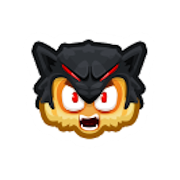
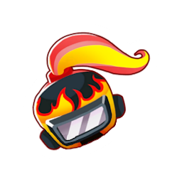
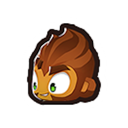
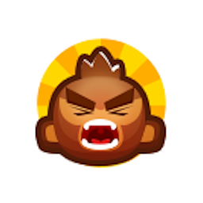
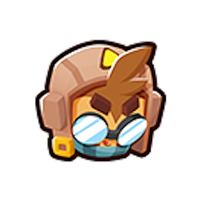
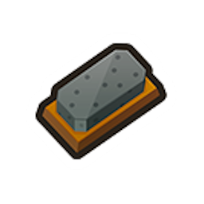

<h1 align="center">

Buffs In Shop
</h1>

<h3 align="center">Adds many tower buffs to the in game shop that can be directly purchased for towers</h3>

Adds 50+ of the game's buffs as entries into the shop that can be purchased to permanently apply them to a tower.

Most buffs get a 50% discount for subsequent purchases.

By default, buffs will only show up in the shop if the tower/upgrade they originate from is allowed to be used in the
current match. This can be configured in the Mod Settings (globally or on a per-buff basis), along with the costs of the buffs.
(To make a buff stop appearing in the shop at all, set the cost to -1)

There is also a setting that allows placing buffs on any tower regardless of the Tower Set or Tower Type restrictions.

There is also a special "God Boost" buff at the end of the shop that applies all valid buffs to a tower for a set cost.
There are settings for if you want specific buffs to be excluded from that.

**Tip: The Useful Utilities setting "Three Column Shop" is helpful to use due to how many buffs are added.**

### Buffs

<!--Start-->

|                            Icon                             |                Name                |                                                                                        Description                                                                                        |  Cost   | Discount |
|:-----------------------------------------------------------:|:----------------------------------:|:-----------------------------------------------------------------------------------------------------------------------------------------------------------------------------------------:|:-------:|:--------:|
|          |         Acidic Mixture Dip         |                                               Makes a tower able to pop Lead Bloons and deal extra damage to Ceramic and MOAB-class Bloons.                                               |  $3500  |   Yes    |
|             |           Berserker Brew           |                                                        Gives a tower a brew that increases damage, pierce, range and attack speed.                                                        |  $7000  |   Yes    |
|         |         Stronger Stimulant         |                                                    Gives a tower with Berserker Brew further increased pierce, range and attack speed.                                                    | $14250  |   Yes    |
|                   |              Take Aim              |                                                                Gives a tower improved range, accuracy, and Camo detection.                                                                |  $1500  |    No    |
|             |          Take Better Aim           |                                Improves the Take Aim buff on a tower to further improve range and accuracy, and allow damaging Black/White/Purple Bloons.                                 |  $1625  |    No    |
|                 |             Overclock              |                                                        Supercharges a tower's attack speed, or other effects if it doesn't attack.                                                        | $13500  |    No    |
|                |             Ultraboost             |                                                Gives a tower a stacking Overclock buff that increases in power each round, up to 10 times.                                                | $72000  |   Yes    |
|            |          Monkey Villager           |                                                                            Gives a tower 10% increased range.                                                                             |  $600   |   Yes    |
|               |            Jungle Drums            |                                                                         Gives a tower 18% increased attack speed.                                                                         |  $750   |   Yes    |
|           |          Primary Training          |                                                              Gives a Primary monkey more range, pierce and projectile speed.                                                              |  $400   |   Yes    |
|          |         Primary Mentoring          |                                       Gives a tower with Primary Training increased range, tier 1 upgrades for free, and reduced ability cooldowns.                                       |  $1250  |   Yes    |
|          |         Primary Expertise          |                                 Gives a tower with Primary Mentoring more popping power, tier 2 upgrades for free, and further reduced ability cooldowns.                                 |  $5000  |   Yes    |
|              |           Radar Scanner            |                                                                         Makes a tower able to attack Camo Bloons.                                                                         |  $1000  |   Yes    |
|  |     Monkey Intelligence Bureau     |                                                  Grants special Bloon popping knowledge to a Tower, allowing it to pop all Bloon types.                                                   |  $3750  |   Yes    |
|                |            Call To Arms            |                                                                         Gives a tower +50% attack speed and pops.                                                                         | $20000  |   Yes    |
|           |          Homeland Defense          |                                                             Gives a tower with Call to Arms now +100% attack speed and pops.                                                              | $40000  |   Yes    |
|                |            Monkey Town             |                                                                     Makes a monkey get 50% extra cash per Bloon pop.                                                                      |  $5000  |   Yes    |
|                |            Monkey City             |                                                                       Gives a tower 20% increased cash generation.                                                                        |  $5000  |   Yes    |
|              |           Absolute Zero            |                                                                      Gives an Ice Monkey 50% increased attack speed.                                                                      |  $9500  |   Yes    |
|              |           Elite Sniping            |                                                           Gives a Sniper Monkey Elite targeting prio and 33% more attack speed.                                                           |  $2000  |   Yes    |
|                 |             Energized              |                                                                       Gives a tower 20% reduced ability cooldowns.                                                                        |  $4000  |   Yes    |
|            |          Energized Fully           |                                       Makes an Energized tower have 40% reduced cooldowns if its in water, and/or earn XP 50% faster if its a Hero.                                       | $10000  |   Yes    |
|              |           Sub Commanded            |                                                                        Gives a Monkey Sub extra pierce and damage.                                                                        | $10000  |   Yes    |
|           |          Flagship Carried          |                                                           Gives a water based monkey or Monkey Ace 18% increased attack speed.                                                            |  $750   |   Yes    |
|            |          Shinobi Tactics           |                                            Gives a Ninja Monkey 8% increased pierce and 8% reduced attack cooldown. Stackable up to 20 times.                                             |  $1200  |    No    |
|                   |              Poplust               |                                                       Gives a Druid 15% increased attack speed and pierce. Stackable up to 5 times.                                                       |  $2350  |    No    |
|             |           Abyss Dwelling           |                                                                            Gives a tower 10% increased pierce.                                                                            |  $800   |   Yes    |
|                 |             Echosense              |                                                              Gives a Mermonkey 6% increased range. Stackable up to 10 times.                                                              |  $380   |    No    |
|        |        Finally Harmonizing         |                                                        Gives a Magic monkey +3 pierce, or a Hero 15% improved range and cooldowns.                                                        |  $1250  |   Yes    |
|                 |       Sun Temple's Blessing        |                                                                       Gives a tower the support of the Sun Temple.                                                                        | $50000  |   Yes    |
|                |      True Sun God's Blessing       |                                                     Gives a tower with the the Sun Temple's Blessing the support of the True Sun God.                                                     | $50000  |   Yes    |
|          |         Paragon Overclock          |                                                           Overclocks a tower and other towers near it. Can be used on Paragons.                                                           | $325000 |    No    |
|       |       Paragon Sub Commanded        |                Gives a Hero x6 damage, x3 pierce, -23% attack speed, and 5x XP. Gives a Monkey Sub x7 damage and x3 pierce. Gives a Paragon 10% reduced ability cooldowns.                | $100000 |   Yes    |
|                |            Bomb Expert             |               Gives a tower +5% range and 25% pierce. A Bomb Shooter gets 24% increased attack speed, and a Mortar Monkey gets that as well as 10% increased blast radius.                |  $2000  |   Yes    |
|          |         Artillery Command          |                                                             Gives a Bomb Shooter or Mortary Monkey double damage and pierce.                                                              | $40000  |   Yes    |
|          |         Sacrificial Totem          |            Gives a tower +1 pierce, +20% range, +18% attack speed, +25 projectile speed, and Camo Detection. Wizard Monkeys gain an additional +1 pierce and 6% attack speed.             |  $3500  |   Yes    |
|                  |             Heated Up              |                                                           Gives a tower +1 Pierce and allows it to pop Lead and Frozen Bloons.                                                            |  $1000  |   Yes    |
|             |          Super Heated Up           |                                                           Gives a tower with Heated Up +1 damage and +2 damage to Lead Bloons.                                                            |  $6000  |   Yes    |
|        |        Pyrotechnics Expert         |                      Gives a Ring of Fire Tack Shooter, Signal Flare Mortar, or Dragon's Breath Wizard 20% increased projectile size and 25% increased attack speed.                      |  $1300  |   Yes    |
|                  |             Bank Hack              |                                                                   Gives a Monkey Bank 12% increased income generation.                                                                    |  $2500  |   Yes    |
|              |           Rallying Roar            |                                                                                 Gives a tower +3 damage.                                                                                  | $15000  |   Yes    |
|            |          Nature's Clarity          |                                                                        Give a Magic monkey +5 range and +2 pierce.                                                                        |  $900   |   Yes    |
|              |           Natures Wrath            |                                              Gives a Druid increased pierce, range, income, attack speed, tornado size, and Camo Detection.                                               |  $5000  |   Yes    |
|            |          Blood Sacrifice           | Gives Adora or a Sun Avatar/Temple/God 10% increased range and 10% reduced reload time, but puts you $500 in debt. Can be purchased up to 5 times per tower, doubling the debt each time. |  $1000  |    No    |
|              |           Naval Tactics            |                                            Gives a water based monkey double attack speed, +1 Pierce, Normal damage type, and Camo detection.                                             | $25000  |   Yes    |
|              |           Etienne Range            |                                                                             Give a tower 20% increased range.                                                                             |  $900   |   Yes    |
|            | Bottle of 'Gerry's Fire' Hot Sauce |                                             2.8 million Bloonville units. Whoever tastes this special sauce will be spewing fire permanently!                                             |  $3250  |    No    |
|                |             Fertilizer             |               Does that farm of yours have bananas? Want even more bananas? Sprinkle this extra-strength magical fertilizer directly on that farm and get more banana now!                |  $5000  |    No    |
|              |           Jar of Pickles           |                                           Try these pickles on one of your Monkey Towers and it will hit harder, but shoot slower, permanently.                                           |  $750   |    No    |
|     |      See Invisibility Potion       |                           Whatever Monkey you gift with this extremely efficacious elixir will be able to see Camo Bloons with ease! Effects will not wear off.                           |  $2000  |    No    |
|           |          Sharpening Stone          |                                Sharpen those darts, friend! Apply this to your darts and blades and they'll be sharper than ever before. Does not run out.                                |  $1000  |    No    |
|                    |              Ice Age               |                                                Gives a tower that can Freeze Bloons +150% Freeze duration. Ice Monkeys also get +5 range.                                                 |  $4000  |   Yes    |
|                  |             God Boost              |                                                                      Applies many other Buffs from the Shop at once.                                                                      | $500000 |   Yes    |

<!--End-->

